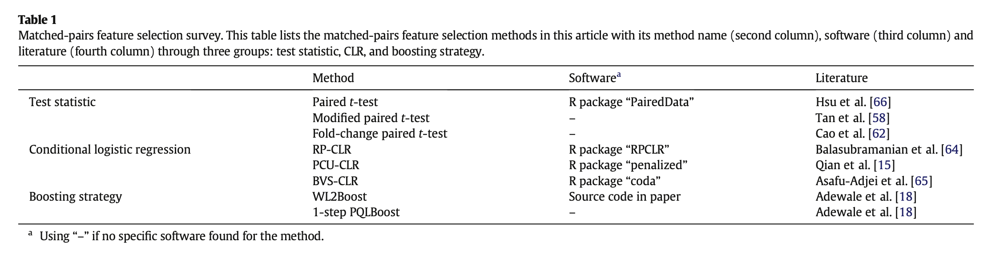
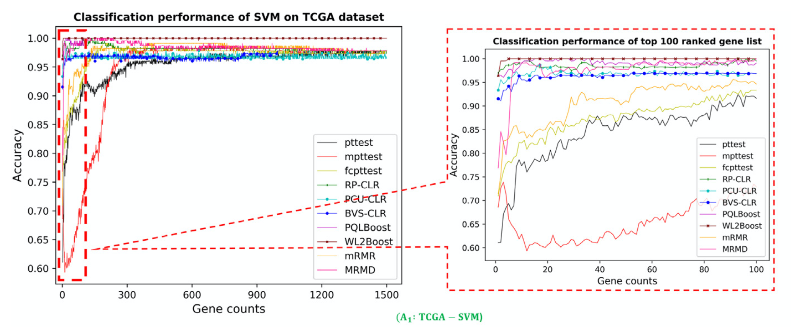

# A Review of Matched-pairs Feature Selection Methods for Gene Expression Data Analysis

In this review, we compare the performance of 10 feature-selection methods (eight MPFS methods and two traditional unpaired methods) on two real datasets by applied three classification methods, and analyze the algorithm complexity of these methods through the running of their programs. 

## Try use this code

`S1-ttest.R`
- Paired t-test           
- Modified paired t-test 
- Fold-change paired t-test

`S22-boosting.R` (copy from orignial paper code)
- Boosting Weighted L2 Loss (WL2Boost).
- 1-Step Penalized Quasi-Likelihood (1-Step PQLBoost)

`S3-CLR.R`
- Random penalized conditional logistic regression (RPCLR)
- Penalized Conditional and Unconditional Logistic Regression (PCU-CLR)

`3rdpart / BVS-CLR folder`
- Bayesian Variable Selection Conditional Logistic Regression (BVS- CLR)

`3rdpart / MRMD-master.zip`
- MRMD algorithm

`MRMR algorithm`
- refer to orignal paper

## compare experiments
try use `run.R` script